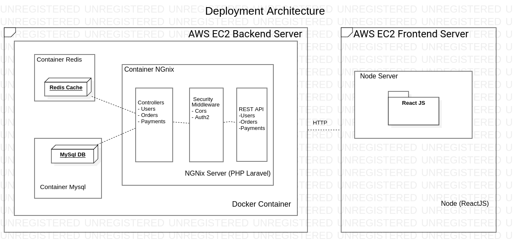

# The Yummi Pizza (Frontend)

This project is part of the test to work remotely at Innoscripta (created by Fidel Mamani Maquera). 

The Project allows user ti register, make order fro pizzas, and pay for them using a fake credit card that is only allowed for testing delivered by Stripe. 

## Architecture of the Complete Appication

This project was bootstrapped with [Create React App](https://github.com/facebook/create-react-app) 
and it is using the next libraries: 
Markup: - [x] axios
        - [x] node-sass
        - [x] react
        - [x] react-dom
        - [x] react-promise-tracker
        - [x] react-redux
        - [x] react-router-dom
        - [x] react-scripts
        - [x] react-stripe-checkout
        - [x] redux
        - [x] redux-logger
        - [x] redux-persist
        - [x] reselect
        - [x] rxjs
        - [x] styled-components

## Usage and Installation
 Markup : * Installation
              * Install nodejs ( higher than V. 10.0)
              * Clone this repo
              * Execute command to download all dependancies `npm install`
              * Execute command to run the app `npm test`
              * Execute command to run the app `npm start`
              
          * Usage
              * Go to your Browser an open [http://localhost:3000](http://localhost:3000)
